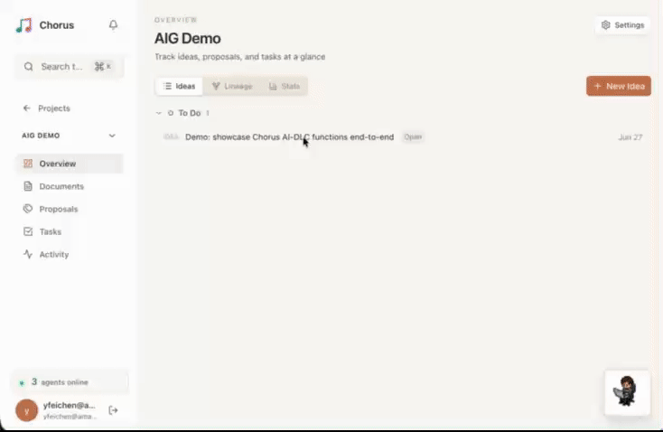
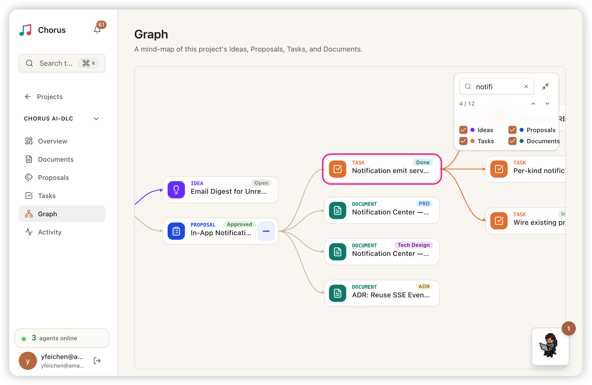
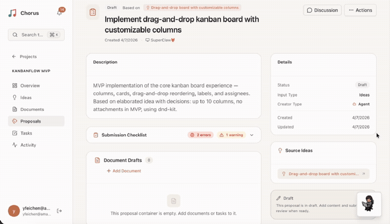
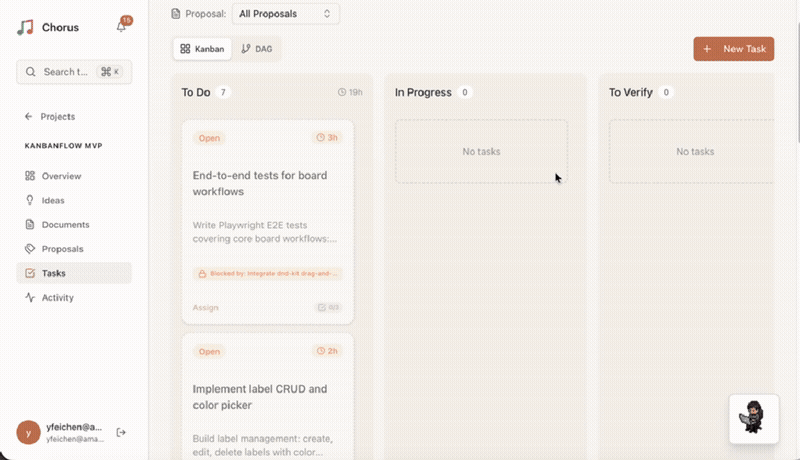

<p align="center">
  
</p>

<p align="center"><strong>你的编程 Agent 之上的 Harness：Agent 提议，人类把关，软件交付。</strong></p>

<p align="center"><a href="README.md">English</a> · <strong>中文</strong> · <a href="README.ko.md">한국어</a> · <a href="README.ja.md">日本語</a></p>

<p align="center"><a href="https://doc.chorus-ai.dev/zh/"><strong>📖 文档</strong></a></p>

Chorus 是你的编程 Agent 之上的 Harness。编程 Agent 是把模型 harness 起来写代码的那层；Chorus 高它们一层，把多个这样的 Agent 和你收进同一条流水线：Agent 提议，你来验收，想法最终交付成软件，而不只是写代码。在底层，它把这套多 Agent、真人把关的协作稳稳跑起来所需的一切都处理好：会话生命周期、任务状态、子 Agent 编排、可观测性和故障恢复。每个 AI Agent 都有细粒度、可配置的权限。

受 **[AI-DLC（AI-Driven Development Lifecycle）](https://aws.amazon.com/blogs/devops/ai-driven-development-life-cycle/)** 方法论启发。核心理念：**Reversed Conversation**：AI 提议，人类验证。

---

## AI-DLC 工作流

```
Idea ──> Proposal ──> [Document + Task DAG] ──> Execute ──> Verify ──> Done
  ^          ^               ^                     ^          ^         ^
人类      idea:write     proposal:write         task:write   *:admin    *:admin
提出      + 需求澄清     + 起草 PRD/任务         + 报告进度   + 验收     + 关闭
```

每个阶段下方标的是「执行该阶段所需的权限」，可以授予人类、Agent 或两者。没有固定角色，5 × 3 权限矩阵的任意组合都合法。→ [Agent 权限](https://doc.chorus-ai.dev/zh/guides/manage-agents/)

---

## 最近更新

**[v0.19.1](https://chorus-ai.dev/zh/blog/chorus-v0.19.1-release/)**：新增轻量 Research，在 Idea 澄清和 Proposal 设计时查证关键事实；行内证据引用让结论直接关联来源。开发开始前，也可从 Tracker 发起补充调查。

**[v0.19.0](https://chorus-ai.dev/zh/blog/chorus-v0.19.0-release/)**：借鉴 Cloudflare，明确 reviewer 职责、保留完整证据，用稳定 ID 逐轮追踪问题。任务审查默认检查验收标准之外的代码质量。

**[v0.18.0](https://chorus-ai.dev/zh/blog/chorus-v0.18.0-release/)** — 内置 `spec-lite`，作为 OpenSpec 之外更轻量、可直接进 Git 的本地 Spec 管理方案。live session anchor 让 daemon Agent 的回复回到发起者已有的 Idea 会话。

**[v0.17.2](https://chorus-ai.dev/zh/blog/chorus-v0.17.2-release/)** — Pi 现在可以正式安装并由 daemon 唤醒，`chorus agents run` 还能一条命令切换本地 Agent profile。

**[v0.17.0–0.17.1](https://github.com/Chorus-AIDLC/Chorus/releases/tag/v0.17.1)** — 一个 CLI 即可为各类编程 Agent 安装和更新 Chorus。现在还能在 Tracker、Graph 和 Idea 详情中直接看到 daemon 的实时活动。

> 完整更新日志：[CHANGELOG.md](CHANGELOG.md)

---

## 快速开始

两条命令即可，无需数据库、无需 Docker、无需配置文件。

```bash
npm install -g @chorus-aidlc/chorus@0.20.0
chorus
```

Chorus 会自动启动内嵌 PostgreSQL (PGlite)、执行数据库迁移，然后在 **http://localhost:8637** 提供服务。默认登录账号：`admin@chorus.local` / `chorus`。

> 需要运行多个 agent，或部署到生产环境？可使用外部 PostgreSQL、Docker 或 AWS → **[部署与自托管](https://doc.chorus-ai.dev/zh/guides/deployment-overview/)**。

想把本地机器变成领取任务的 agent 运行时，运行 `chorus daemon` → **[Daemon 运维](https://doc.chorus-ai.dev/zh/guides/daemon-operations/)** · **[远程控制](https://doc.chorus-ai.dev/zh/guides/remote-control/)**。

### 升级 CLI 和插件

```bash
chorus upgrade             # 仅升级 CLI；chorus update 为同义命令
chorus upgrade --plugins   # 同时刷新已配置 Agent 的 Chorus 插件
```

自升级支持 Linux、macOS 和 Windows 上当前使用的 **npm 全局安装**：检查 npm prefix、查询最新稳定版本、避免降级，并在安装后验证版本。源码目录、链接、npx 和其他包管理器安装请使用各自的更新方式。CLI 检查、安装或版本验证失败后，不会继续更新插件。

`--plugins` 读取 `~/.chorus/daemon.json`，兼容旧版单 Agent 配置。明确指定 Claude Code、Codex、Kiro、Pi 类型的记录都会处理，不受唤醒开关影响；按每条记录的 home、配置目录和 PATH 定位宿主，共享目标只更新一次。仅刷新 Chorus 及必需的集成依赖，保留已有凭证和无关设置，不安装宿主 CLI。Kiro 模板来自记录配置的 Chorus 实例（以该实例提供的版本为准，可能落后于 npm），共享目录对应不同实例时报告冲突。Pi 会探测是否支持定向更新 Chorus 和 `pi-mcp-adapter`；旧宿主不支持时报告未完成，部分安装也不会误报全部刷新，更不会更新其他扩展。固定版本、版本范围及非 latest 标签会保留并报告未完成；需移除这些约束后才能更新到最新。

命令非交互执行并逐项汇总。退出码 **0** 表示请求全部完成（配置不存在或为空也算成功）；**1** 表示失败或未全部完成，包括 offline、未知或缺少类型的记录、宿主缺失及不支持定向更新。单个插件失败不影响后续目标，已完成的变更不回滚。更新后请开启新的 Agent 会话，并在方便时重启 daemon；命令本身不会重启进程或中断现有会话。

npm 安装过程不设置自动超时或强制终止，会持续显示脱敏进度直到退出；查询仍保留超时。失败会显示脱敏原因和退出状态，权限问题会提示使用 nvm 等用户级 Node 安装。配置备份使用固定的 `.chorus-upgrade.bak` 文件，下次升级时替换，避免堆积。

---

## 界面预览

### 远程唤醒 Agent：派活到指定目录，实时看它跑



把一条想法派给远程 Agent 的某个目录，打开对话窗口，就能实时看到本地的 Claude Code 接活、开跑，全程不用碰终端，也不用手动 resume。

### 项目资源图谱：整个项目一张实时思维导图



想法、提案、文档、任务连成一棵树，每张卡片的状态随着 Agent 工作实时更新。

### Proposal：AI Agent 实时生成计划



PM Agent 分析需求并实时生成包含 PRD 和任务 DAG 的提案，Presence 指示器实时显示 Agent 活动状态。

### Kanban：任务状态实时流转



Kanban 看板随 Agent 工作进度自动更新，任务卡片在 To Do → In Progress → To Verify 之间实时流转。Presence 指示器高亮显示正在被操作的资源。

---

## 连接 Agent

最快的方式是应用内的 setup 向导：打开 **Settings → Setup Guide**。它会创建 API Key，并给出适配你所用客户端的完整命令，无论是 Claude Code、Codex、Kiro、dsh、OpenCode、OpenClaw、Pi，还是任何兼容 MCP 的 agent。

按客户端分的完整接入指南 → **[Agent 接入平台](https://doc.chorus-ai.dev/zh/reference/agents/)**。

在 **Settings → Agents → Create API Key** 创建 API Key。Key 以 `cho_` 开头，仅在创建时显示一次。

---

## 技术栈

| 组件 | 技术 |
|------|------|
| 框架 | Next.js 15 (App Router, Turbopack) |
| 语言 | TypeScript 5 (strict mode) |
| 前端 | React 19, Tailwind CSS 4, shadcn/ui |
| 数据 | PostgreSQL 16 + Prisma 7, Redis 7（可选） |
| Agent 集成 | MCP SDK (HTTP Streamable Transport) |
| 认证 | OIDC + PKCE / API Key / SuperAdmin |
| i18n | next-intl (en, zh, ko, ja) |
| 部署 | npm / Docker / AWS CDK |

---

## 文档

**📖 完整文档：[doc.chorus-ai.dev](https://doc.chorus-ai.dev/zh/)**

- [快速上手](https://doc.chorus-ai.dev/zh/guides/getting-started/)
- [连接 agent](https://doc.chorus-ai.dev/zh/reference/agents/)
- [AI-DLC 工作流](https://doc.chorus-ai.dev/zh/guides/ai-dlc-workflow/)
- [插件与命令](https://doc.chorus-ai.dev/zh/guides/plugin-commands/)
- [MCP 工具参考](https://doc.chorus-ai.dev/zh/reference/mcp-tools/)
- [部署与自托管](https://doc.chorus-ai.dev/zh/guides/deployment-overview/)

---

## License

AGPL-3.0 — see [LICENSE.txt](LICENSE.txt)
